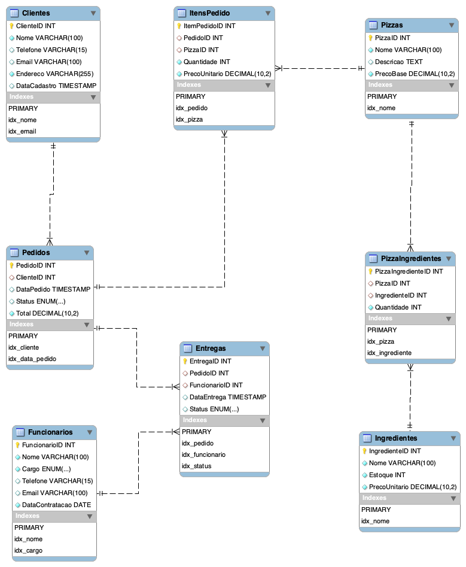

# pizzaria


## Barbas Pizzas.

Projeto voltad para o seguimento  gastronômico focado em pizzarias.


## Arquitetura


## Estrutura da Base de Dados

Abaixo está um exemplo de schema para uma base de dados de uma pizzaria, considerando o uso do MySQL como servidor de banco de dados. Este schema inclui as tabelas principais e os relacionamentos entre elas.

| Principais tabelas |
| ------------------ |
| Clientes           |
| Pedidos            |
| ItensPedidos       |
| Pizzas             |
| Ingredientes       |
| PizzaIngredientes  |
| Funcionarios       |
| Entregas           |

### Estruturas das tableas

- **Clientes**

Armazena informações sobre os clientes.

```sql
CREATE TABLE Clientes (
    ClienteID INT AUTO_INCREMENT PRIMARY KEY,
    Nome VARCHAR(100) NOT NULL,
    Telefone VARCHAR(15),
    Email VARCHAR(100),
    Endereco VARCHAR(255) NOT NULL,
    DataCadastro TIMESTAMP DEFAULT CURRENT_TIMESTAMP,
    INDEX idx_nome (Nome), -- Índice para busca por nome
    INDEX idx_email (Email) -- Índice para busca por email
);
```

- **Pedidos**

Armazena informações sobre os pedidos realizados pelos clientes.

```sql
CREATE TABLE Pedidos (
    PedidoID INT AUTO_INCREMENT PRIMARY KEY,
    ClienteID INT,
    DataPedido TIMESTAMP DEFAULT CURRENT_TIMESTAMP,
    Status ENUM('Recebido', 'Preparando', 'Pronto', 'Entregue') DEFAULT 'Recebido',
    Total DECIMAL(10, 2) NOT NULL,
    FOREIGN KEY (ClienteID) REFERENCES Clientes(ClienteID)
);
```

- **ItensPedido**

Armazena os itens (pizzas) que compõem cada pedido.

```sql
CREATE TABLE ItensPedido (
    ItemPedidoID INT AUTO_INCREMENT PRIMARY KEY,
    PedidoID INT,
    PizzaID INT,
    Quantidade INT NOT NULL,
    PrecoUnitario DECIMAL(10, 2) NOT NULL,
    FOREIGN KEY (PedidoID) REFERENCES Pedidos(PedidoID),
    FOREIGN KEY (PizzaID) REFERENCES Pizzas(PizzaID)
);
```

- **Pizzas**

Armazena informações sobre as pizzas disponíveis no cardápio.

```sql
CREATE TABLE Pizzas (
    PizzaID INT AUTO_INCREMENT PRIMARY KEY,
    Nome VARCHAR(100) NOT NULL,
    Descricao TEXT,
    PrecoBase DECIMAL(10, 2) NOT NULL
);
```

- **Ingredientes**

Armazena os ingredientes disponíveis para as pizzas.

```sql
CREATE TABLE Ingredientes (
    IngredienteID INT AUTO_INCREMENT PRIMARY KEY,
    Nome VARCHAR(100) NOT NULL,
    Estoque INT NOT NULL,
    PrecoUnitario DECIMAL(10, 2) NOT NULL
);
```

- **PizzaIngredientes**

Armazena os ingredientes que compõem cada pizza.

```sql
CREATE TABLE PizzaIngredientes (
    PizzaIngredienteID INT AUTO_INCREMENT PRIMARY KEY,
    PizzaID INT,
    IngredienteID INT,
    Quantidade INT NOT NULL,
    FOREIGN KEY (PizzaID) REFERENCES Pizzas(PizzaID),
    FOREIGN KEY (IngredienteID) REFERENCES Ingredientes(IngredienteID)
);
```

- **Funcionarios**

Armazena informações sobre os funcionários da pizzaria.

```sql
CREATE TABLE Funcionarios (
    FuncionarioID INT AUTO_INCREMENT PRIMARY KEY,
    Nome VARCHAR(100) NOT NULL,
    Cargo ENUM('Pizzaiolo', 'Entregador', 'Atendente') NOT NULL,
    Telefone VARCHAR(15),
    Email VARCHAR(100),
    DataContratacao DATE NOT NULL
);
```

- **Entregas**

Armazena informações sobre as entregas dos pedidos.

```sql
CREATE TABLE Entregas (
    EntregaID INT AUTO_INCREMENT PRIMARY KEY,
    PedidoID INT,
    FuncionarioID INT,
    DataEntrega TIMESTAMP DEFAULT CURRENT_TIMESTAMP,
    Status ENUM('Pendente', 'EmTransito', 'Entregue') DEFAULT 'Pendente',
    FOREIGN KEY (PedidoID) REFERENCES Pedidos(PedidoID),
    FOREIGN KEY (FuncionarioID) REFERENCES Funcionarios(FuncionarioID)
);
```


### Relacionamentos

- **Clientes** e **Pedidos**: Um cliente pode fazer vários pedidos, mas cada pedido pertence a um único cliente (`Clientes.ClienteID` -> `Pedidos.ClienteID`).
- **Pedidos** e **ItensPedido**: Um pedido pode conter vários itens (pizzas), mas cada item pertence a um único pedido (`Pedidos.PedidoID` -> `ItensPedido.PedidoID`).
- **ItensPedido** e **Pizzas**: Cada item do pedido refere-se a uma pizza específica (`ItensPedido.PizzaID` -> `Pizzas.PizzaID`).
- **Pizzas** e **PizzaIngredientes**: Uma pizza pode ter vários ingredientes, e cada ingrediente pode ser usado em várias pizzas (`Pizzas.PizzaID` -> `PizzaIngredientes.PizzaID` e `Ingredientes.IngredienteID` -> `PizzaIngredientes.IngredienteID`).
- **Pedidos** e **Entregas**: Cada pedido pode ter uma entrega associada, e cada entrega refere-se a um único pedido (`Pedidos.PedidoID` -> `Entregas.PedidoID`).
- **Funcionarios** e **Entregas**: Um funcionário pode realizar várias entregas, mas cada entrega é feita por um único funcionário (`Funcionarios.FuncionarioID` -> `Entregas.FuncionarioID`).

### Modelagem das Tabelas





### Script para criar banco com a estrutura de tabelas

Abaixo script para criar toda a estrutura de tabelas incluindo a inseção de daos para testes

```sql
-- Criação do banco de dados
CREATE DATABASE IF NOT EXISTS pizzaria;
USE pizzaria;

-- Tabela Clientes
CREATE TABLE Clientes (
    ClienteID INT AUTO_INCREMENT PRIMARY KEY,
    Nome VARCHAR(100) NOT NULL,
    Telefone VARCHAR(15),
    Email VARCHAR(100),
    Endereco VARCHAR(255) NOT NULL,
    DataCadastro TIMESTAMP DEFAULT CURRENT_TIMESTAMP,
    INDEX idx_nome (Nome), -- Índice para busca por nome
    INDEX idx_email (Email) -- Índice para busca por email
);

-- Tabela Pizzas
CREATE TABLE Pizzas (
    PizzaID INT AUTO_INCREMENT PRIMARY KEY,
    Nome VARCHAR(100) NOT NULL,
    Descricao TEXT,
    PrecoBase DECIMAL(10, 2) NOT NULL,
    INDEX idx_nome (Nome) -- Índice para busca por nome da pizza
);

-- Tabela Ingredientes
CREATE TABLE Ingredientes (
    IngredienteID INT AUTO_INCREMENT PRIMARY KEY,
    Nome VARCHAR(100) NOT NULL,
    Estoque INT NOT NULL,
    PrecoUnitario DECIMAL(10, 2) NOT NULL,
    INDEX idx_nome (Nome) -- Índice para busca por nome do ingrediente
);

-- Tabela PizzaIngredientes
CREATE TABLE PizzaIngredientes (
    PizzaIngredienteID INT AUTO_INCREMENT PRIMARY KEY,
    PizzaID INT,
    IngredienteID INT,
    Quantidade INT NOT NULL,
    FOREIGN KEY (PizzaID) REFERENCES Pizzas(PizzaID),
    FOREIGN KEY (IngredienteID) REFERENCES Ingredientes(IngredienteID),
    INDEX idx_pizza (PizzaID), -- Índice para busca por PizzaID
    INDEX idx_ingrediente (IngredienteID) -- Índice para busca por IngredienteID
);

-- Tabela Pedidos
CREATE TABLE Pedidos (
    PedidoID INT AUTO_INCREMENT PRIMARY KEY,
    ClienteID INT,
    DataPedido TIMESTAMP DEFAULT CURRENT_TIMESTAMP,
    Status ENUM('Recebido', 'Preparando', 'Pronto', 'Entregue') DEFAULT 'Recebido',
    Total DECIMAL(10, 2) NOT NULL,
    FOREIGN KEY (ClienteID) REFERENCES Clientes(ClienteID),
    INDEX idx_cliente (ClienteID), -- Índice para busca por ClienteID
    INDEX idx_data_pedido (DataPedido) -- Índice para ordenação/filtro por data
);

-- Tabela ItensPedido
CREATE TABLE ItensPedido (
    ItemPedidoID INT AUTO_INCREMENT PRIMARY KEY,
    PedidoID INT,
    PizzaID INT,
    Quantidade INT NOT NULL,
    PrecoUnitario DECIMAL(10, 2) NOT NULL,
    FOREIGN KEY (PedidoID) REFERENCES Pedidos(PedidoID),
    FOREIGN KEY (PizzaID) REFERENCES Pizzas(PizzaID),
    INDEX idx_pedido (PedidoID), -- Índice para busca por PedidoID
    INDEX idx_pizza (PizzaID) -- Índice para busca por PizzaID
);

-- Tabela Funcionarios
CREATE TABLE Funcionarios (
    FuncionarioID INT AUTO_INCREMENT PRIMARY KEY,
    Nome VARCHAR(100) NOT NULL,
    Cargo ENUM('Pizzaiolo', 'Entregador', 'Atendente') NOT NULL,
    Telefone VARCHAR(15),
    Email VARCHAR(100),
    DataContratacao DATE NOT NULL,
    INDEX idx_nome (Nome), -- Índice para busca por nome
    INDEX idx_cargo (Cargo) -- Índice para busca por cargo
);

-- Tabela Entregas
CREATE TABLE Entregas (
    EntregaID INT AUTO_INCREMENT PRIMARY KEY,
    PedidoID INT,
    FuncionarioID INT,
    DataEntrega TIMESTAMP DEFAULT CURRENT_TIMESTAMP,
    Status ENUM('Pendente', 'EmTransito', 'Entregue') DEFAULT 'Pendente',
    FOREIGN KEY (PedidoID) REFERENCES Pedidos(PedidoID),
    FOREIGN KEY (FuncionarioID) REFERENCES Funcionarios(FuncionarioID),
    INDEX idx_pedido (PedidoID), -- Índice para busca por PedidoID
    INDEX idx_funcionario (FuncionarioID), -- Índice para busca por FuncionarioID
    INDEX idx_status (Status) -- Índice para busca por status
);

-- Inserção de dados iniciais para teste (opcional)

-- Clientes
INSERT INTO Clientes (Nome, Telefone, Email, Endereco) VALUES
('João Silva', '11987654321', 'joao.silva@email.com', 'Rua A, 123'),
('Maria Oliveira', '11912345678', 'maria.oliveira@email.com', 'Rua B, 456');

-- Pizzas
INSERT INTO Pizzas (Nome, Descricao, PrecoBase) VALUES
('Margherita', 'Molho de tomate, mussarela, manjericão', 40.00),
('Calabresa', 'Molho de tomate, mussarela, calabresa, cebola', 45.00),
('Quatro Queijos', 'Molho de tomate, mussarela, provolone, gorgonzola, parmesão', 50.00);

-- Ingredientes
INSERT INTO Ingredientes (Nome, Estoque, PrecoUnitario) VALUES
('Molho de tomate', 100, 5.00),
('Mussarela', 200, 10.00),
('Manjericão', 50, 2.00),
('Calabresa', 100, 8.00),
('Cebola', 150, 3.00),
('Provolone', 80, 12.00),
('Gorgonzola', 60, 15.00),
('Parmesão', 70, 10.00);

-- PizzaIngredientes
INSERT INTO PizzaIngredientes (PizzaID, IngredienteID, Quantidade) VALUES
(1, 1, 1), -- Margherita: Molho de tomate
(1, 2, 1), -- Margherita: Mussarela
(1, 3, 1), -- Margherita: Manjericão
(2, 1, 1), -- Calabresa: Molho de tomate
(2, 2, 1), -- Calabresa: Mussarela
(2, 4, 1), -- Calabresa: Calabresa
(2, 5, 1), -- Calabresa: Cebola
(3, 1, 1), -- Quatro Queijos: Molho de tomate
(3, 2, 1), -- Quatro Queijos: Mussarela
(3, 6, 1), -- Quatro Queijos: Provolone
(3, 7, 1), -- Quatro Queijos: Gorgonzola
(3, 8, 1); -- Quatro Queijos: Parmesão

-- Funcionarios
INSERT INTO Funcionarios (Nome, Cargo, Telefone, Email, DataContratacao) VALUES
('Carlos Souza', 'Pizzaiolo', '11987654321', 'carlos.souza@email.com', '2023-01-15'),
('Ana Lima', 'Entregador', '11912345678', 'ana.lima@email.com', '2023-02-10'),
('Pedro Rocha', 'Atendente', '11923456789', 'pedro.rocha@email.com', '2023-03-05');

-- Pedidos
INSERT INTO Pedidos (ClienteID, Total) VALUES
(1, 85.00), -- João Silva
(2, 90.00); -- Maria Oliveira

-- ItensPedido
INSERT INTO ItensPedido (PedidoID, PizzaID, Quantidade, PrecoUnitario) VALUES
(1, 1, 1, 40.00), -- João Silva: Margherita
(1, 2, 1, 45.00), -- João Silva: Calabresa
(2, 3, 2, 50.00); -- Maria Oliveira: Quatro Queijos (2x)

-- Entregas
INSERT INTO Entregas (PedidoID, FuncionarioID, Status) VALUES
(1, 2, 'Entregue'), -- Entrega do pedido 1 feita por Ana Lima
(2, 2, 'EmTransito'); -- Entrega do pedido 2 em trânsito por Ana Lima
```

### Como Importar no MySQL

1. Salve o script acima em um arquivo com a extensão `.sql`, por exemplo, `pizzaria.sql`.

2. Abra o MySQL (via linha de comando ou uma interface gráfica como MySQL Workbench).

3. Execute o seguinte comando para criar o banco de dados e importar o script:
   ```bash
   mysql -u seu_usuario -p Pizzaria < pizzaria.sql
   ```

   Substitua `seu_usuario` pelo seu nome de usuário do MySQL. Você será solicitado a inserir a senha.

4. Após a importação, o banco de dados `Pizzaria` estará pronto para uso, com as tabelas e dados iniciais configurados.


### Testando o Banco de Dados

Você pode executar consultas para verificar se tudo foi criado corretamente. Por exemplo:

```sql
USE Pizzaria;

-- Listar todos os clientes
SELECT * FROM Clientes;

-- Listar todos os pedidos com detalhes dos clientes
SELECT p.PedidoID, c.Nome AS Cliente, p.DataPedido, p.Status, p.Total
FROM Pedidos p
JOIN Clientes c ON p.ClienteID = c.ClienteID;

-- Listar os ingredientes de uma pizza específica
SELECT pi.PizzaID, p.Nome AS Pizza, i.Nome AS Ingrediente, pi.Quantidade
FROM PizzaIngredientes pi
JOIN Pizzas p ON pi.PizzaID = p.PizzaID
JOIN Ingredientes i ON pi.IngredienteID = i.IngredienteID
WHERE p.PizzaID = 1; -- Margherita
```

